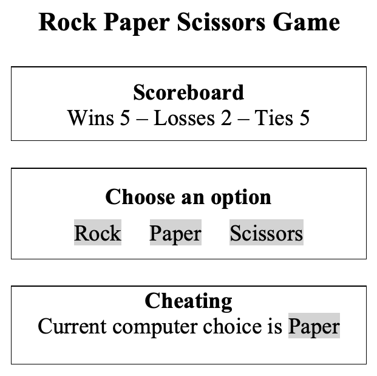

# CS569 Homework 04
## Angular Change Detection
Your will build a Rock-Paper-Scissors game application with Angular framework, the application has the following components:  
* AppComponent (root)
  * ButtonComponent (reusable)
  * ScoreComponent (reusable)
    
### Application Specifications
* The root component will have the following state: `{w: number, l: number, computer: string}` to track number of wins/losses, and hold the computer choice. Score will be displayed using the reusable score component. Implement all actions in `AppComponent`, treat the state as immutable object. Display the previous computer choice after every state change.
* Game choices should be declared as `enum`.  Display all three game choices using three reusable button components. Pass the button label and function that needs to be triggered on click event.
* Implement `OnChanges` and `DoCheck` interfaces for both `button` and `score` components. Notice when each hook is triggered.
  

  

